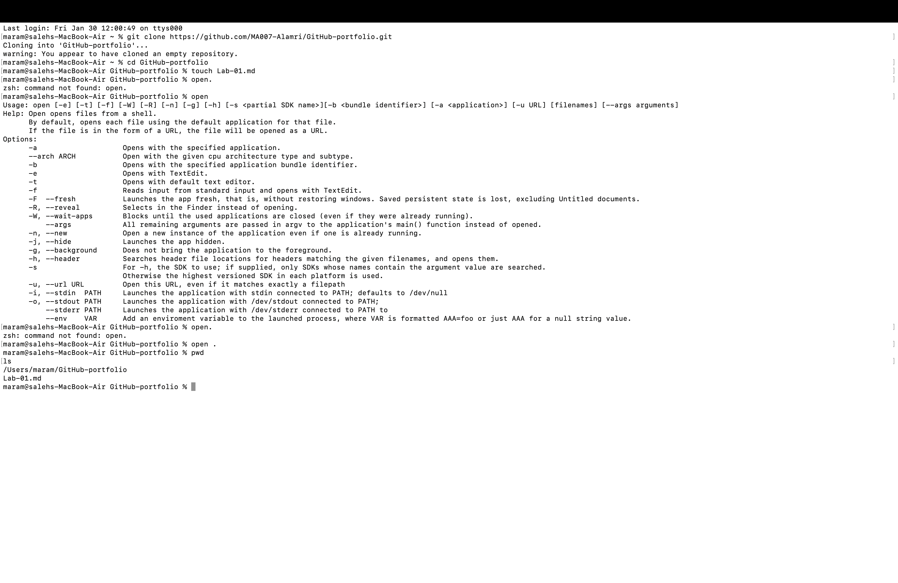

# Lab 01: Infrastructure Audit

**Name:** Maram Alamri  
**Date:** January 30, 2026  
**Status:** Completed  

## Objective
To document the 2021 Facebook outage and practice using GitHub for enterprise documentation.

## Key Findings (Case Study)
1. **The Event:** Facebook (Meta) disappeared from the internet due to a configuration error.
2. **The Technical Cause:** A bad command deleted BGP routes.
3. **The Impact:** DNS resolvers could not find Facebook servers.

## Proof of Work
(Screenshot added below)!
